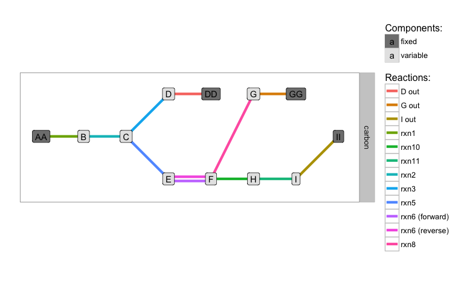
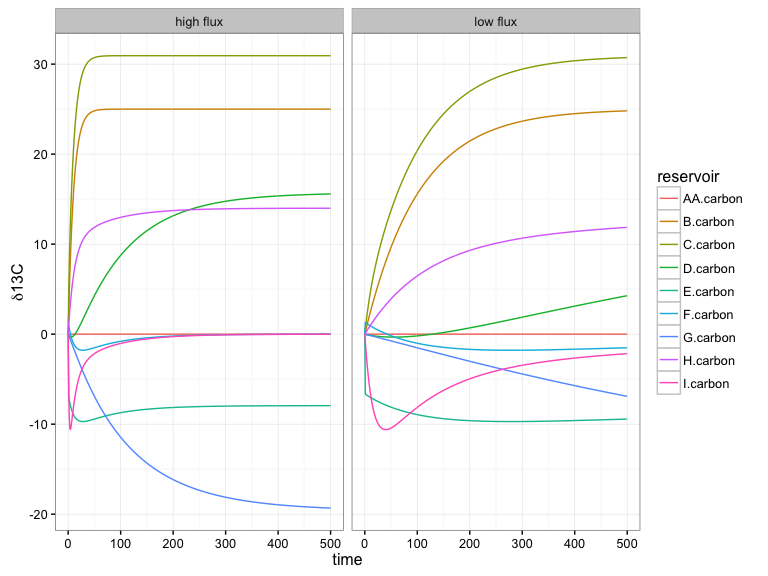
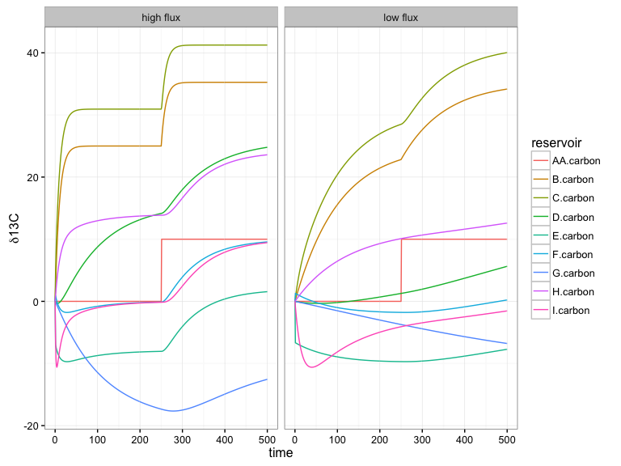
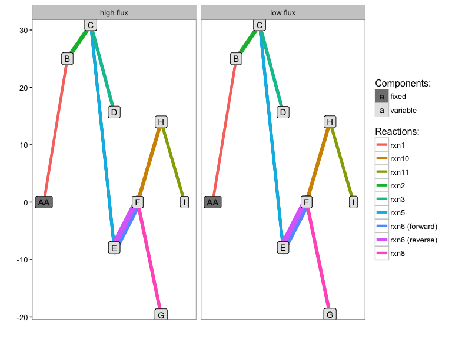
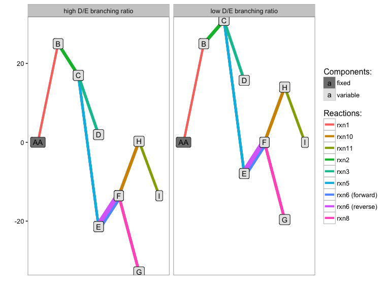

# isocyclr

[](https://travis-ci.org/sebkopf/isocyclr)
[](https://codecov.io/github/sebkopf/isocyclr?branch=master)


This R package is intended as an educational tool to facilitate the modeling of isotopic effects through biogeochemical pathways and cycles including non-steady state and steady-state solutions. Core functionality for the construction of reaction networks and the corresponding system of differential equations is fully implemented and can be explored for multiple isotope systems in parallel. Automatically generated reaction diagrams and symbolic representation of the system of differential equations make it easy to check system structure. However, the package is still very much a work in progress and only generic custom and standard reaction types are implemented at this point as well as rudimentary computation of steady-state solutions. All implemented functionality is automatically tested with pretty good coverage to avoid updates accidentally breaking existing code.

## Installation

```
install.packages("devtools")
devtools::install_github("sebkopf/isocyclr")
```

# Example

Load **isocyclr** and other packages used in these examples. Help on all functions is available within R (e.g. via `?add_standard_reaction`).

```{r, message=FALSE, warning=FALSE}
library(isocyclr)
library(ggplot2)
library(magrittr)
library(dplyr)
library(tidyr)
```

## Set up reaction path

Set up a reaction network akin to Figure 2 in the classic paper by John Hayes *Fractionation of carbon and hydrogen isotopes in biosynthetic processes. Rev Mineral Geochem 43, 225–277. (2001)*.

```{r}
path <- isopath() %>%
  add_isotope("carbon") %>%
  add_component("AA", carbon, variable = FALSE) %>%
  add_component(LETTERS[2:9], carbon) %>% # add B through I
  add_component(c("DD", "GG", "II"), carbon, variable = FALSE) %>% # out flux
  add_standard_reaction(AA == B, eps.carbon = e1, flux = dm) %>%
  add_standard_reaction(B == C, eps.carbon = e2, flux = dm) %>%
  add_standard_reaction(C == D, eps.carbon = e3, flux = f3 * dm) %>%
  add_standard_reaction(D == DD, eps.carbon = 0, flux = f3 * dm, name = "D out") %>%
  add_standard_reaction(C == E, eps.carbon = e4, flux = (1-f3) * dm) %>%
  add_standard_reaction(E == F, eps.carbon.eq = e5, flux = (1-f3) *dm, eq_ratio = "P/S") %>%
  add_standard_reaction(F == G, eps.carbon = e6, flux = (1-f3) *f6 * dm) %>%
  add_standard_reaction(G == GG, eps.carbon = 0, flux = (1-f3) *f6 * dm, name = "G out") %>%
  add_standard_reaction(F == H, eps.carbon = e7, flux = (1-f3) * (1-f6) * dm) %>%
  add_standard_reaction(H == I, eps.carbon = e8, flux = (1-f3) * (1-f6) * dm) %>%
  add_standard_reaction(I == II, eps.carbon = 0, flux = (1-f3) * (1-f6) * dm, name = "I out")
```

#### Schematic

```{r rxn_diagram, fig.width = 8, fig.height = 5}
path %>% generate_reaction_diagram() + coord_equal()
```



#### System of differential equations

Look at the system of differential equations generated for the reaction network.

```{r}
path %>% get_ode_matrix() %>% knitr::kable()
```

|x        |value    |dx/dt                                                                                                                                                                                                                                                                                                                                                  |
|:--------|:--------|:------------------------------------------------------------------------------------------------------------------------------------------------------------------------------------------------------------------------------------------------------------------------------------------------------------------------------------------------------|
|B        |B        |1 * dm + -1 * dm                                                                                                                                                                                                                                                                                                                                       |
|B.carbon |B.carbon |1 * dm/B * (fractionate(AA.carbon, eps = e1) - B.carbon) + -1 * dm/B * (fractionate(B.carbon, eps = e2) - B.carbon)                                                                                                                                                                                                                                    |
|C        |C        |1 * dm + -1 * (f3 * dm) + -1 * ((1 - f3) * dm)                                                                                                                                                                                                                                                                                                         |
|C.carbon |C.carbon |1 * dm/C * (fractionate(B.carbon, eps = e2) - C.carbon) + -1 * (f3 * dm)/C * (fractionate(C.carbon, eps = e3) - C.carbon) + -1 * ((1 - f3) * dm)/C * (fractionate(C.carbon, eps = e4) - C.carbon)                                                                                                                                                      |
|D        |D        |-1 * (f3 * dm) + 1 * (f3 * dm)                                                                                                                                                                                                                                                                                                                         |
|D.carbon |D.carbon |1 * (f3 * dm)/D * (fractionate(C.carbon, eps = e3) - D.carbon) + -1 * (f3 * dm)/D * (fractionate(D.carbon, eps = 0) - D.carbon)                                                                                                                                                                                                                        |
|E        |E        |1 * ((1 - f3) * dm) + -1 * dir_flux((1 - f3) * dm, rev = 1, dir = "+") + -1 * dir_flux((1 - f3) * dm, rev = 1, dir = "-")                                                                                                                                                                                                                              |
|E.carbon |E.carbon |1 * ((1 - f3) * dm)/E * (fractionate(C.carbon, eps = e4) - E.carbon) + -1 * dir_flux((1 - f3) * dm, rev = 1, dir = "+")/E * (fractionate(E.carbon, eps = e5, m = TRUE) - E.carbon) + -1 * dir_flux((1 - f3) * dm, rev = 1, dir = "-")/E * (F.carbon - E.carbon)                                                                                        |
|F        |F        |-1 * ((1 - f3) * (1 - f6) * dm) + 1 * dir_flux((1 - f3) * dm, rev = 1, dir = "+") + 1 * dir_flux((1 - f3) * dm, rev = 1, dir = "-") + -1 * ((1 - f3) * f6 * dm)                                                                                                                                                                                        |
|F.carbon |F.carbon |1 * dir_flux((1 - f3) * dm, rev = 1, dir = "+")/F * (fractionate(E.carbon, eps = e5, m = TRUE) - F.carbon) + 1 * dir_flux((1 - f3) * dm, rev = 1, dir = "-")/F * (F.carbon - F.carbon) + -1 * ((1 - f3) * f6 * dm)/F * (fractionate(F.carbon, eps = e6) - F.carbon) + -1 * ((1 - f3) * (1 - f6) * dm)/F * (fractionate(F.carbon, eps = e7) - F.carbon) |
|G        |G        |-1 * ((1 - f3) * f6 * dm) + 1 * ((1 - f3) * f6 * dm)                                                                                                                                                                                                                                                                                                   |
|G.carbon |G.carbon |1 * ((1 - f3) * f6 * dm)/G * (fractionate(F.carbon, eps = e6) - G.carbon) + -1 * ((1 - f3) * f6 * dm)/G * (fractionate(G.carbon, eps = 0) - G.carbon)                                                                                                                                                                                                  |
|H        |H        |1 * ((1 - f3) * (1 - f6) * dm) + -1 * ((1 - f3) * (1 - f6) * dm)                                                                                                                                                                                                                                                                                       |
|H.carbon |H.carbon |1 * ((1 - f3) * (1 - f6) * dm)/H * (fractionate(F.carbon, eps = e7) - H.carbon) + -1 * ((1 - f3) * (1 - f6) * dm)/H * (fractionate(H.carbon, eps = e8) - H.carbon)                                                                                                                                                                                     |
|I        |I        |-1 * ((1 - f3) * (1 - f6) * dm) + 1 * ((1 - f3) * (1 - f6) * dm)                                                                                                                                                                                                                                                                                       |
|I.carbon |I.carbon |1 * ((1 - f3) * (1 - f6) * dm)/I * (fractionate(H.carbon, eps = e8) - I.carbon) + -1 * ((1 - f3) * (1 - f6) * dm)/I * (fractionate(I.carbon, eps = 0) - I.carbon)                                                                                                                                                                                      |

## Assign parameters

The symbols used in reaction network setup can be assigned numeric values (multiple scenarios if needed) that get evaluated upon running the model.

```{r}
path <- path %>%
  set_parameters(
    data_frame(
      scenario = c("low flux", "high flux"),
      # fluxes and flux fractions
      dm = c(0.1, 1), f3 = 0.2, f6 = 0.2,
      # isotopic effects
      e1 = 0, e2 = 25, e3 = 15, e4 = 35, e5 = 8, e6 = 20, e7 = 0, e8 = 14,
      # starting isotopic composition
      AA.carbon = 0, B.carbon = 0, C.carbon = 0, D.carbon = 0, E.carbon = 0,
      F.carbon = 0, G.carbon = 0, H.carbon = 0, I.carbon = 0,
      # pool sizes for variable components
      B = 10, C = 1, D = 20, E = 10, F = 50, G = 20, H = 10, I = 1
      )
  )
```

## Run model

Running the system of differential equations is easily done and uses the ode solvers of the **deSolve** package.

```{r}
model <- path %>% run_model(time_steps = 500)
```

## Plot time course

```{r time_course, fig.width = 8, fig.height = 6}
model %>%
  gather(reservoir, delta, ends_with("carbon")) %>%
  ggplot() + aes(time, delta, color = reservoir) +
  geom_line() + theme_bw() +
  labs(y = expression(delta*13*'C')) +
  facet_grid(~scenario)
```




## Run model with event

Additional parameters can be passed and will be forwarded to the ode solver, e.g. introducing different starting isotopic composition part way through via a timed event.

```{r time_course_event, fig.width = 8, fig.height = 6}
model2 <- path %>% run_model(
  time_steps = 500, make_state_var = c("AA.carbon"),
  events = list(data = data.frame(
    var = "AA.carbon", time = 250, value = 10, method = "rep")))
last_plot() %+%
  gather(model2, reservoir, delta, ends_with("carbon"))
```



## Run to steady state

The model can also be run to steady-state using runsteady functionality from the *rootSolve* package. All parameters are forwarded to the ode/root solver.

```{r}
steady <- path %>% run_steady_state(stol = 1e-5, rtol = 1e-3)
```

#### Steady state isotopic composition

Looking at the steady state results, there is no difference between low and high flux once steady-state is reached (the correct behavior). Since fractionation is calculated precisely when using `add_standard_reaction()` (without any $\alpha \approx 1$ approximations), the isotopic offsets are not exactly the $\epsilon$ values provided.

```{r steady_state, fig.width = 8, fig.height = 6}
path %>% generate_reaction_diagram(
  steady %>% gather(component, y, ends_with("carbon")) %>%
    mutate(component = sub(".carbon", "", component, fixed = T)) %>%
    select(scenario, component, y)
) + facet_grid(~scenario)
```



Changing the the branching flux at nodes however, does change the outcome as expected. As an example:

```{r}
steady2 <- path %>%
  set_parameters(scenario = c("low D/E branching ratio", "high D/E branching ratio"),
                 dm = c(1, 1), f3 = c(0.2, 0.9)) %>%
  run_steady_state(stol = 1e-5, rtol = 1e-3)
```

```{r steady_state_branching, fig.width = 8, fig.height = 6}
path %>% generate_reaction_diagram(
  steady2 %>% gather(component, y, ends_with("carbon")) %>%
    mutate(component = sub(".carbon", "", component, fixed = T)) %>%
    select(scenario, component, y)
) + facet_grid(~scenario)
```


